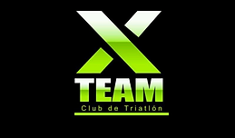
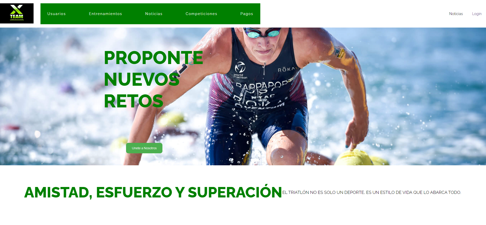
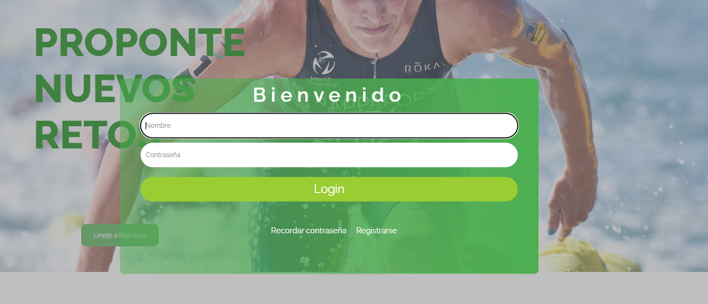
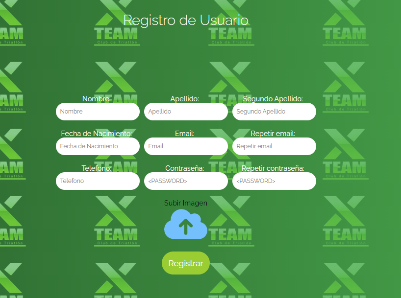
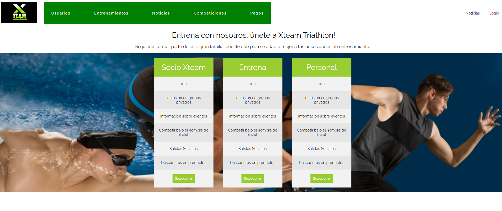

# Xteam Project

## Goals for this Application

The goal of the project is to provide the necessary tools for a sports company to improve the administration of their users, manage invoices, and organize their operations.

This project is developed using the React.js framework for the frontend and Node.js for the backend.

The database for the project is relational, using MySQL.

## Components of the Project

### Main Page

This is the entry page of the app and displays the general elements of the project.

### Login Page

This is the login page of the app for login or registration of users.

### Register Page

This is the registration page of the app.

### Subscription Options Page

Users can select their preferred subscription option.

